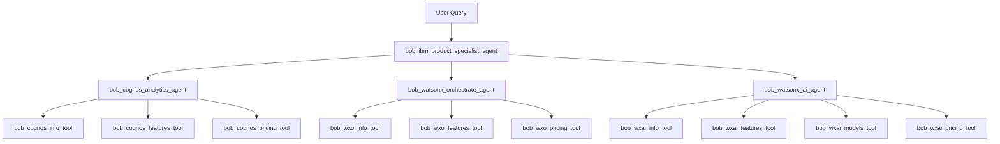

# IBM Product Specialist Multi-Agent System - Implementation Plan

## Project Overview

Build a multi-agent system on IBM watsonx Orchestrate with a supervisor agent coordinating three specialized sub-agents to answer questions about IBM products: Cognos Analytics, Watsonx Orchestrate, and Watsonx.ai.

## Architecture Design



## Component Breakdown

### 1. Supervisor Agent
**Name:** `bob_ibm_product_specialist_agent`
- **Type:** Native Agent
- **Style:** Default (for routing and coordination)
- **LLM:** `groq/openai/gpt-oss-120b`
- **Collaborators:**
  - `bob_cognos_analytics_agent`
  - `bob_watsonx_orchestrate_agent`
  - `bob_watsonx_ai_agent`
- **Tools:** None (delegates to sub-agents)
- **Instructions:** Route user queries to appropriate product specialist agent based on question context. Includes GPT-OSS-120b specific optimizations for knowledge base prioritization and proper formatting.

### 2. Sub-Agents

#### 2.1 Cognos Analytics Agent
**Name:** `bob_cognos_analytics_agent`
- **Type:** Native Agent
- **Style:** React (for tool reasoning)
- **LLM:** `groq/openai/gpt-oss-120b`
- **Tools:**
  - `bob_cognos_info_tool`
  - `bob_cognos_features_tool`
  - `bob_cognos_pricing_tool`
- **Instructions:** Expert on IBM Cognos Analytics, use tools to fetch latest information from IBM website

#### 2.2 Watsonx Orchestrate Agent
**Name:** `bob_watsonx_orchestrate_agent`
- **Type:** Native Agent
- **Style:** React (for tool reasoning)
- **LLM:** `groq/openai/gpt-oss-120b`
- **Tools:**
  - `bob_wxo_info_tool`
  - `bob_wxo_features_tool`
  - `bob_wxo_pricing_tool`
- **Instructions:** Expert on IBM Watsonx Orchestrate, use tools to fetch latest information from IBM website

#### 2.3 Watsonx.ai Agent
**Name:** `bob_watsonx_ai_agent`
- **Type:** Native Agent
- **Style:** React (for tool reasoning)
- **LLM:** `groq/openai/gpt-oss-120b`
- **Tools:**
  - `bob_wxai_info_tool`
  - `bob_wxai_features_tool`
  - `bob_wxai_models_tool`
  - `bob_wxai_pricing_tool`
- **Instructions:** Expert on IBM Watsonx.ai, use tools to fetch latest information from IBM website

### 3. Web Crawling Tools

All tools will be Python-based using the `@tool` decorator with web scraping capabilities.

#### Tool Architecture
Each tool will:
1. Use `requests` library to fetch web pages
2. Use `BeautifulSoup4` to parse HTML content
3. Extract relevant text, headings, and structured data
4. Return formatted markdown for better readability
5. Handle errors gracefully (timeouts, 404s, etc.)
6. Support multiple URL crawling where needed

#### Common Dependencies (requirements.txt)
```
requests>=2.31.0
beautifulsoup4>=4.12.0
lxml>=4.9.0
```

#### Tool Specifications

##### Cognos Analytics Tools

**1. bob_cognos_info_tool**
- **URL:** https://www.ibm.com/products/cognos-analytics
- **Purpose:** Fetch general product information, overview, and key benefits
- **Extracts:** Product description, key features summary, use cases

**2. bob_cognos_features_tool**
- **URL:** https://www.ibm.com/products/cognos-analytics/features
- **Purpose:** Fetch detailed feature information
- **Extracts:** Feature list, capabilities, technical specifications

**3. bob_cognos_pricing_tool**
- **URL:** https://www.ibm.com/products/cognos-analytics/pricing
- **Purpose:** Fetch pricing information and plans
- **Extracts:** Pricing tiers, plan details, cost information

##### Watsonx Orchestrate Tools

**1. bob_wxo_info_tool**
- **URL:** https://www.ibm.com/products/watsonx-orchestrate
- **Purpose:** Fetch general product information
- **Extracts:** Product overview, key benefits, use cases

**2. bob_wxo_features_tool**
- **URLs (Multi-page crawl):**
  - https://www.ibm.com/products/watsonx-orchestrate/ai-agent-builder
  - https://www.ibm.com/products/watsonx-orchestrate/agent-catalog
  - https://www.ibm.com/products/watsonx-orchestrate/governance-and-observability
  - https://www.ibm.com/products/watsonx-orchestrate/multi-agent-orchestration
- **Purpose:** Fetch comprehensive feature information from multiple pages
- **Extracts:** All feature details, capabilities across different aspects

**3. bob_wxo_pricing_tool**
- **URL:** https://www.ibm.com/products/watsonx-orchestrate/pricing
- **Purpose:** Fetch pricing information
- **Extracts:** Pricing plans, cost details

##### Watsonx.ai Tools

**1. bob_wxai_info_tool**
- **URL:** https://www.ibm.com/products/watsonx-ai
- **Purpose:** Fetch general product information
- **Extracts:** Product overview, key benefits, platform capabilities

**2. bob_wxai_features_tool**
- **URLs (Multi-page crawl):**
  - https://www.ibm.com/products/watsonx-ai/ai-agent-development
  - https://www.ibm.com/products/watsonx-ai/model-customization
  - https://www.ibm.com/products/watsonx-ai/rag-development
  - https://www.ibm.com/products/watsonx-ai/knowledge-management
- **Purpose:** Fetch comprehensive feature information
- **Extracts:** Feature details across agent development, models, RAG, knowledge management

**3. bob_wxai_models_tool**
- **URL:** https://www.ibm.com/products/watsonx-ai/foundation-models
- **Purpose:** Fetch information about available foundation models
- **Extracts:** Model list, capabilities, specifications

**4. bob_wxai_pricing_tool**
- **URL:** https://www.ibm.com/products/watsonx-ai/pricing
- **Purpose:** Fetch pricing information
- **Extracts:** Pricing plans, cost structure

## Implementation Steps

### Phase 1: Tool Development
1. Create base web scraping utility functions
2. Implement individual tools for each product
3. Test tools independently
4. Add error handling and retry logic

### Phase 2: Sub-Agent Creation
1. Create Cognos Analytics agent with its tools
2. Create Watsonx Orchestrate agent with its tools
3. Create Watsonx.ai agent with its tools
4. Test each sub-agent independently

### Phase 3: Supervisor Agent Creation
1. Create supervisor agent with collaborators
2. Write routing instructions
3. Test multi-agent coordination

### Phase 4: Testing & Refinement
1. Test end-to-end workflows
2. Refine agent instructions
3. Optimize tool performance
4. Document usage and deployment

## File Structure

```
orchestrate-project/
├── agents/
│   ├── bob_ibm_product_specialist_agent.yaml
│   ├── bob_cognos_analytics_agent.yaml
│   ├── bob_watsonx_orchestrate_agent.yaml
│   └── bob_watsonx_ai_agent.yaml
├── tools/
│   ├── cognos_analytics/
│   │   ├── bob_cognos_info_tool.py
│   │   ├── bob_cognos_features_tool.py
│   │   ├── bob_cognos_pricing_tool.py
│   │   └── requirements.txt
│   ├── watsonx_orchestrate/
│   │   ├── bob_wxo_info_tool.py
│   │   ├── bob_wxo_features_tool.py
│   │   ├── bob_wxo_pricing_tool.py
│   │   └── requirements.txt
│   ├── watsonx_ai/
│   │   ├── bob_wxai_info_tool.py
│   │   ├── bob_wxai_features_tool.py
│   │   ├── bob_wxai_models_tool.py
│   │   ├── bob_wxai_pricing_tool.py
│   │   └── requirements.txt
│   └── shared/
│       ├── web_scraper_utils.py
│       └── requirements.txt
└── DEPLOYMENT.md
```

## Deployment Commands

### 1. Import Tools
```bash
# Cognos Analytics Tools
orchestrate tools import -k python -f tools/cognos_analytics/bob_cognos_info_tool.py -r tools/cognos_analytics/requirements.txt
orchestrate tools import -k python -f tools/cognos_analytics/bob_cognos_features_tool.py -r tools/cognos_analytics/requirements.txt
orchestrate tools import -k python -f tools/cognos_analytics/bob_cognos_pricing_tool.py -r tools/cognos_analytics/requirements.txt

# Watsonx Orchestrate Tools
orchestrate tools import -k python -f tools/watsonx_orchestrate/bob_wxo_info_tool.py -r tools/watsonx_orchestrate/requirements.txt
orchestrate tools import -k python -f tools/watsonx_orchestrate/bob_wxo_features_tool.py -r tools/watsonx_orchestrate/requirements.txt
orchestrate tools import -k python -f tools/watsonx_orchestrate/bob_wxo_pricing_tool.py -r tools/watsonx_orchestrate/requirements.txt

# Watsonx.ai Tools
orchestrate tools import -k python -f tools/watsonx_ai/bob_wxai_info_tool.py -r tools/watsonx_ai/requirements.txt
orchestrate tools import -k python -f tools/watsonx_ai/bob_wxai_features_tool.py -r tools/watsonx_ai/requirements.txt
orchestrate tools import -k python -f tools/watsonx_ai/bob_wxai_models_tool.py -r tools/watsonx_ai/requirements.txt
orchestrate tools import -k python -f tools/watsonx_ai/bob_wxai_pricing_tool.py -r tools/watsonx_ai/requirements.txt
```

### 2. Import Sub-Agents (in order)
```bash
orchestrate agents import -f agents/bob_cognos_analytics_agent.yaml
orchestrate agents import -f agents/bob_watsonx_orchestrate_agent.yaml
orchestrate agents import -f agents/bob_watsonx_ai_agent.yaml
```

### 3. Import Supervisor Agent
```bash
orchestrate agents import -f agents/bob_ibm_product_specialist_agent.yaml
```

## Testing Strategy

### Unit Testing
- Test each tool independently with sample URLs
- Verify data extraction accuracy
- Test error handling (network failures, invalid URLs)

### Integration Testing
- Test each sub-agent with its tools
- Verify tool selection and usage
- Test response quality

### End-to-End Testing
- Test supervisor agent routing
- Test multi-turn conversations
- Test cross-product queries

### Test Scenarios
1. **Single Product Query:** "What is Cognos Analytics?"
2. **Feature Query:** "What are the key features of Watsonx Orchestrate?"
3. **Pricing Query:** "How much does Watsonx.ai cost?"
4. **Comparison Query:** "Compare Watsonx Orchestrate and Watsonx.ai"
5. **Multi-aspect Query:** "Tell me about Cognos Analytics features and pricing"

## Success Criteria

1. ✅ All 10 tools successfully crawl and extract data from IBM websites
2. ✅ All 3 sub-agents correctly use their respective tools
3. ✅ Supervisor agent correctly routes queries to appropriate sub-agents
4. ✅ System provides accurate, up-to-date information from IBM websites
5. ✅ Error handling works gracefully for network issues
6. ✅ Response times are acceptable (< 30 seconds per query)
7. ✅ Markdown formatting is clean and readable

## Considerations & Best Practices

### Web Scraping
- Implement rate limiting to avoid overwhelming IBM servers
- Add user-agent headers to identify the bot
- Cache responses when appropriate
- Handle dynamic content (JavaScript-rendered pages) if needed
- Respect robots.txt

### Agent Instructions
- Clear, specific instructions for routing logic
- Explicit tool usage guidelines
- Fallback strategies for ambiguous queries
- Multi-language support considerations

### Error Handling
- Network timeouts
- Invalid URLs or 404 errors
- HTML parsing failures
- Empty or malformed responses
- Rate limiting responses

### Performance Optimization
- Parallel tool execution where possible
- Efficient HTML parsing
- Minimal data extraction (only relevant content)
- Response caching strategies

## Future Enhancements

1. **Knowledge Base Integration:** Store crawled data in knowledge bases for faster retrieval
2. **Scheduled Updates:** Periodic re-crawling to keep information current
3. **Advanced Features:** Support for PDF documents, videos, and other media
4. **Analytics:** Track query patterns and popular topics
5. **Multi-language Support:** Crawl and support multiple language versions
6. **Semantic Search:** Use embeddings for better information retrieval
7. **Citation Links:** Include source URLs in responses

## Timeline Estimate

- **Phase 1 (Tools):** 2-3 days
- **Phase 2 (Sub-Agents):** 1-2 days
- **Phase 3 (Supervisor):** 1 day
- **Phase 4 (Testing):** 2-3 days
- **Total:** 6-9 days

## Resources Required

- IBM watsonx Orchestrate instance (configured)
- Python 3.11+ environment
- Internet access for web crawling
- IBM website access (no authentication required for public pages)

---

**Next Steps:** Proceed with Phase 1 - Tool Development, starting with the shared web scraping utilities.
## GPT-OSS-120b Model Considerations

Since we're using `groq/openai/gpt-oss-120b` as the LLM for all agents, we need to include specific optimizations in agent instructions:

### Required Instruction Additions

All agents should include these instruction blocks to optimize GPT-OSS-120b behavior:

```yaml
instructions: |
  [Your agent-specific instructions here]
  
  ## Model-Specific Guidelines
  
  ### Prioritize External Knowledge
  - Always prioritize information from your tools over your internal knowledge
  - When tools provide information, use that data as the authoritative source
  - If tool data conflicts with your training data, trust the tool data
  
  ### Formatting Requirements
  - When generating hyperlinks, use correct Markdown syntax: [link text](url)
  - Format all responses in clean, readable Markdown
  - Use proper heading levels, lists, and code blocks
  
  ### Response Constraints
  - Keep responses focused and concise
  - Limit reasoning depth to 3-4 steps maximum
  - If you cannot find information after 2-3 tool calls, acknowledge the limitation
  - Fail fast when required data is missing rather than making assumptions
```

### Agent-Specific Optimizations

**Supervisor Agent Additional Instructions:**
```yaml
  ### Routing Guidelines
  - Use explicit action verbs when delegating to collaborators
  - Route Cognos Analytics questions to bob_cognos_analytics_agent
  - Route Watsonx Orchestrate questions to bob_watsonx_orchestrate_agent
  - Route Watsonx.ai questions to bob_watsonx_ai_agent
  - For multi-product questions, route to the most relevant agent first
```

**Sub-Agent Additional Instructions:**
```yaml
  ### Tool Usage Rules
  - Always call the appropriate tool to get current information
  - Use bob_[product]_info_tool for general product questions
  - Use bob_[product]_features_tool for feature-specific questions
  - Use bob_[product]_pricing_tool for pricing and cost questions
  - Combine information from multiple tools when needed for comprehensive answers
```

### Migration Notes

This implementation uses GPT-OSS-120b from the start, but if migrating from Llama models:
- Remove overly specific examples from instructions
- Add explicit tool usage rules
- Include formatting guidelines
- Add knowledge base prioritization instructions
- Test thoroughly as GPT-OSS-120b may behave differently than Llama models
